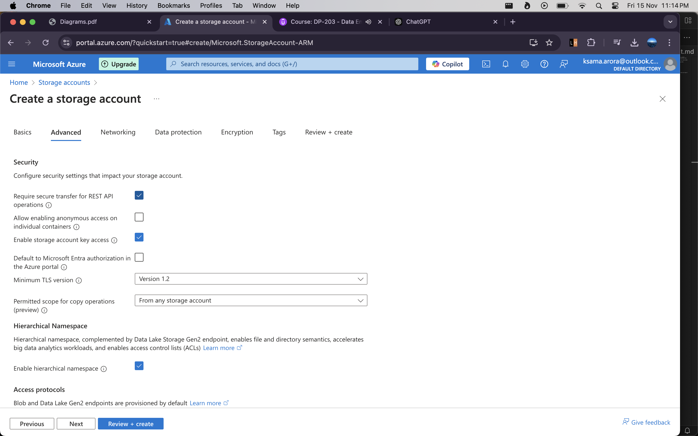

### Azure Data Lake Gen2 and Storage Accounts  

#### 1. **Introduction to Data Lakes**  
- Companies use **central repositories**, such as data lakes, to store massive volumes of raw data.  
- A data lake allows for flexible data storage, enabling transformation and analysis based on specific needs.  
- In Azure, you can use the **Azure Storage Service** as an **Azure Data Lake Gen2 Storage Account** to host a data lake.  
  - This provides a scalable and expansive solution for storing large datasets.  

#### 2. **Creating an Azure Storage Account for Data Lake Gen2**  
- Steps to create a storage account:  
  1. Select **Subscription** and **Resource Group**.  
  2. Enter a **Storage Account Name**.  
  3. Specify the **Region**.  
  4. Choose **Redundancy** (e.g., **LRS** - Locally Redundant Storage).  

- **Advanced Settings**:  
  - Enable **Hierarchical Namespace**.  
    - This feature is essential for Azure Data Lake Gen2 and adds additional capabilities for file and folder management.  

#### 3. **Features of Data Lake Gen2 Storage**  
- With the **Hierarchical Namespace** enabled, you gain:  
  1. The ability to create **directories** within the storage account.  
  2. Support for assigning **individual permissions** to files and folders.  

#### 4. **Supported Data Formats in Data Lake Gen2**  
- You can upload and store data in various formats, including:  
  - **CSV**  
  - **JSON**  
  - **Parquet**  

- **Parquet File Format**:  
  - Stores data in **binary format**.  
  - Offers data **compression**, reducing storage costs and improving performance during data retrieval and processing.  
