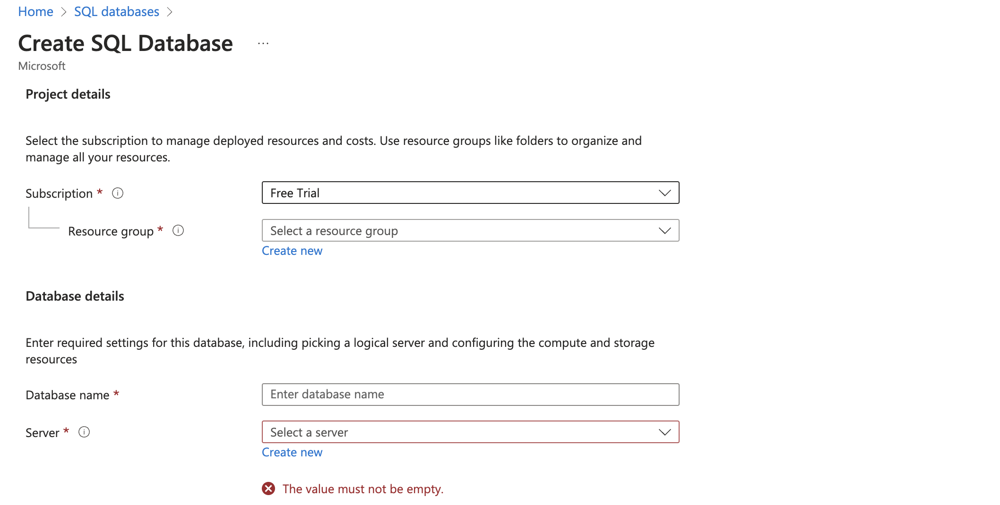
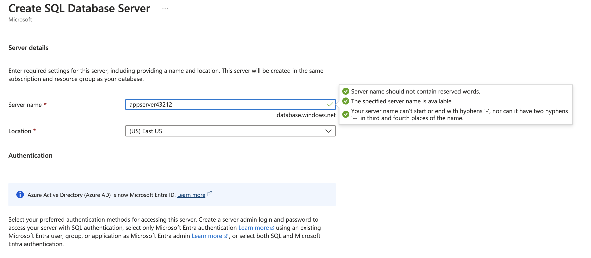
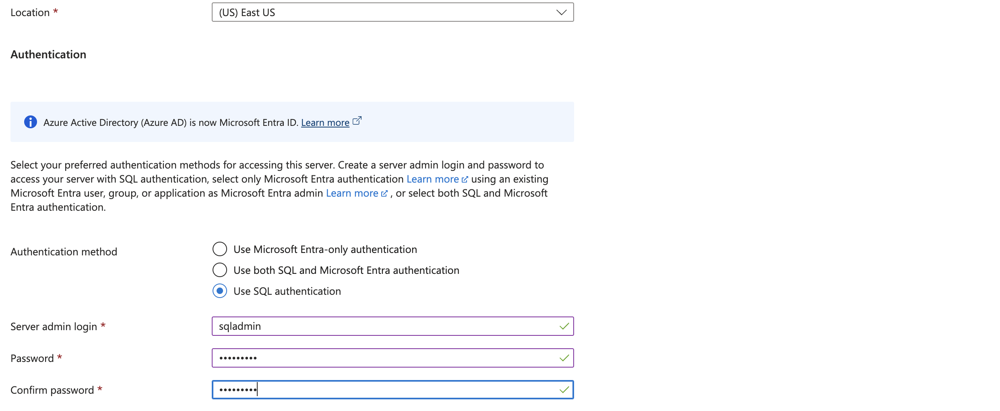

### Working with Azure SQL Database and Transact-SQL (T - SQL)  

#### 1. **Overview of Transact-SQL (T-SQL)**  
- **T-SQL** is an extension of SQL that is used with:  
  - SQL Server  
  - Azure SQL Database  
  - Azure SQL Managed Instance  
  - Azure Synapse Analytics  
  - Analytics Platform System (PDW)  

#### 2. **Setting Up a Relational Database with Azure SQL Database Service**  
- The **Azure SQL Database Service** allows you to work with relational databases in the Azure cloud.  

#### 3. **Steps to Create an Azure SQL Database**  
1. **Choose Azure SQL Database Service** in the Azure portal.  

2. During deployment, two resources are created:  
   - **Azure SQL Database**  
   - **Azure SQL Database Server**  

3. **Authentication**:  
   - Use **SQL Authentication** to log in to the database server.  
   - You will create credentials (username and password) for this purpose.  

4. **Select Database Tier**:  
   - After creating the SQL Database Server, you can choose from various performance tiers.  
   - For this example, select the **Basic Tier**.  

5. **Backup Storage**:  
   - Opt for **Locally Redundant Backup Storage** to ensure data backups are stored within the same region.  

6. **Additional Settings**:  
   - Choose a **Sample Database** to install, such as the **AdventureWorks** database, for testing and practice purposes.  

7. **Review and Create**:  
   - Review the configurations and deploy the resources.  

