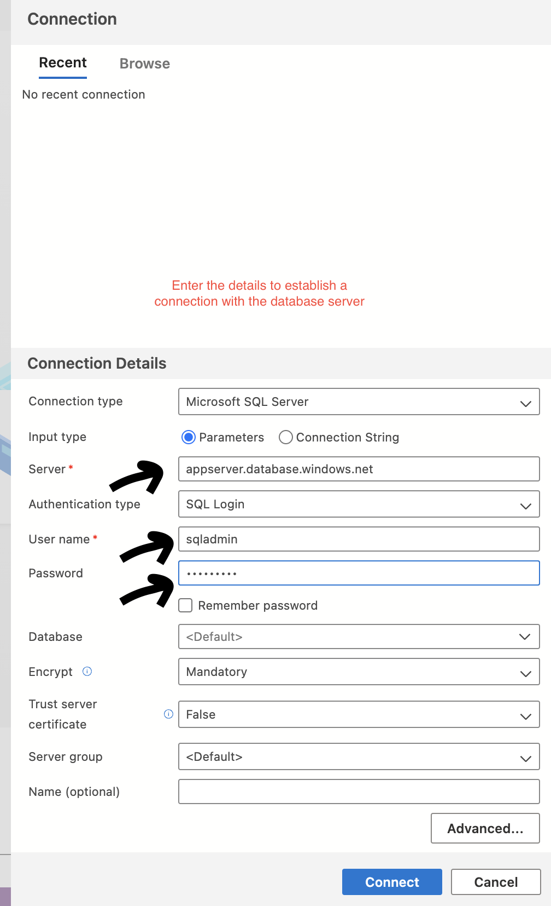

### Install Azure Data Studio

**Overview:**
Azure Data Studio is a free, lightweight tool used to connect to and manage relational database systems, such as SQL Server. It provides a modern interface for querying, managing, and visualizing data.

**Installation Steps:**
1. Visit the official Azure Data Studio download page:  
   [Azure Data Studio Installation Guide](https://learn.microsoft.com/en-us/azure-data-studio/download-azure-data-studio?tabs=win-install%2Cwin-user-install%2Credhat-install%2Cwindows-uninstall%2Credhat-uninstall)
   
2. Choose the appropriate version for your operating system and architecture (e.g., Apple Silicon for M1/M2 Macs).  

3. Follow the instructions on the webpage to complete the installation.

**Post-Installation:**
1. **Create a New Connection:**
   - After launching Azure Data Studio, create a connection to a relational database system.
   - Use the **"Create Connection"** interface as shown in the image below:  
     
   
2. **Verify the Connection:**
   - Once connected, you will see a list of databases and their respective tables.
   - You can now start querying and managing data as needed.
